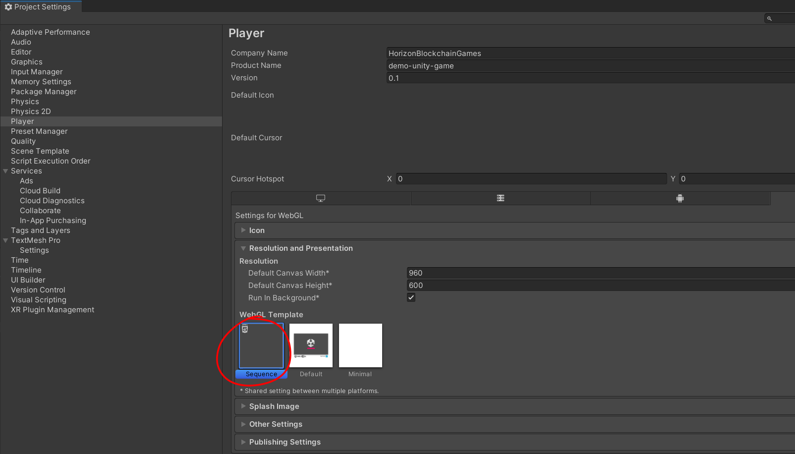

# demo-unity-webgl-game

A demo of common operations of dapp built as a Unity game, compiled to target WebGL.

Checkout the WebGL demo: https://0xsequence.github.io/demo-unity-webgl-game

The demo is written similar to https://github.com/0xsequence/demo-dapp but with Unity.

## WebGL Package: (works with versions later than LTS 2021.2)
### Usage
1. Download the sequence sdk unity package in Releases.
2. Drag the unity package into your Unity WebGL project
3. (Try out the sequence sample scene.)
4. Build Settings/Instructions:
  In Project Settings-> Player, choose Sequence as WebGL template, then make a WebGL build.

### Future Work
1. Add Error Handling.
2. Add Unity 2020 LTS support.

## Demo Gifs:
### Sequence Wallet

---

### Sequence Indexer

In addition to the Sequence Wallet, we also offer the Sequence Indexer to developers which offers
a simple API interface to blockchain token data.

### Load all Skyweaver cards/assets from different contract addresses under the same wallet address

### Possible mini game that uses loaded Skyweaver cards/assets

### Transfer assets between different wallet (Under construction)

