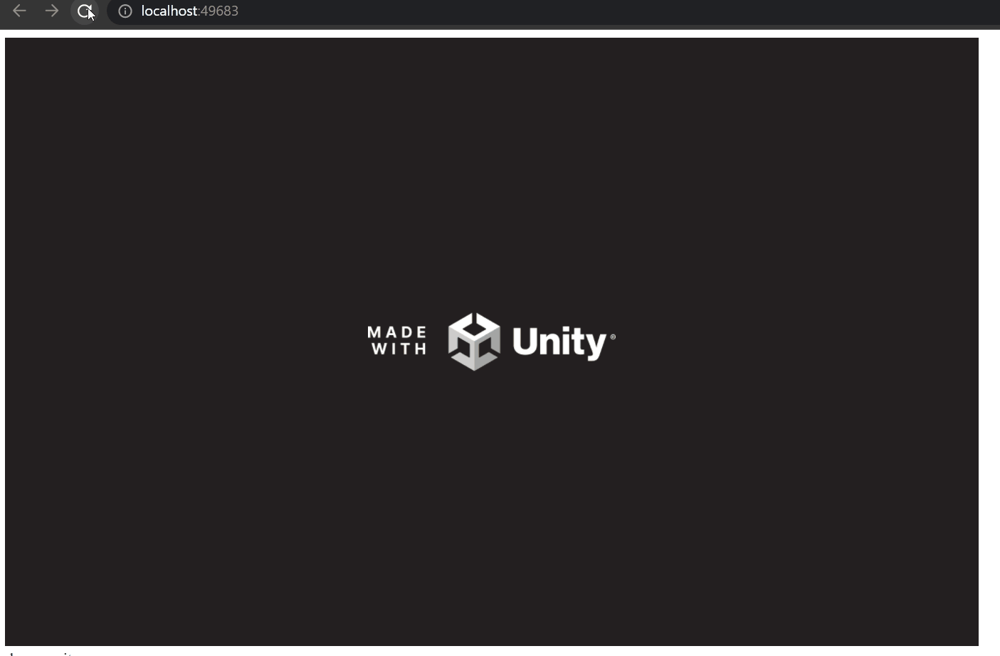
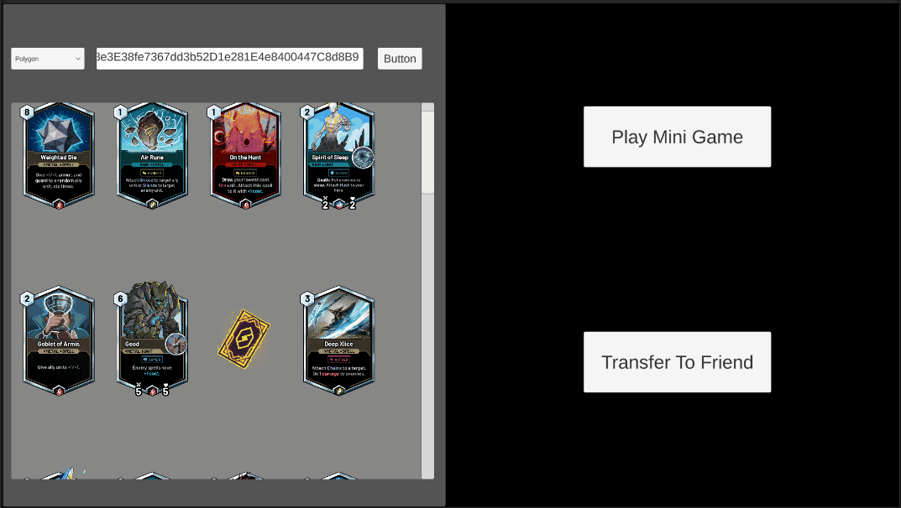
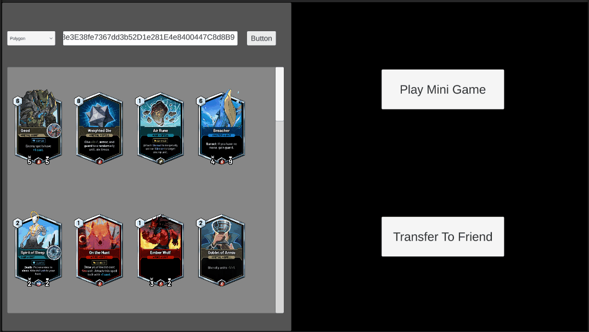

# demo-unity-webgl-game

A demo of common operations of dapp built as a Unity game, compiled to target WebGL.

The demo is written similar to https://github.com/0xsequence/demo-dapp but with Unity.

## Sequence Wallet

---

## Sequence Indexer

In addition to the Sequence Wallet, we also offer the Sequence Indexer to developers which offers
a simple API interface to blockchain token data.

### Load all Skyweaver cards/assets from different contract addresses under the same wallet address

### Possible mini game that uses loaded Skyweaver cards/assets

### Transfer assets between different wallet (Under construction)

