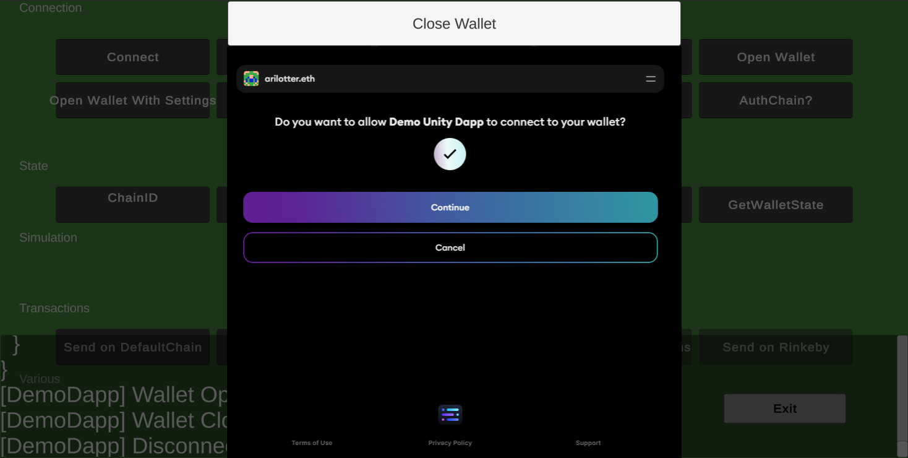

# Web3 Unity SDK
 The Sequence Unity SDK provides full Sequence Wallet & Indexer integration for your Unity Games.

This SDK follows [Semantic Versioning](https://semver.org/) (`major.minor.patch`). While we're still in `0.x.y` builds, API breaking changes can be made at any time. After `1.0.0`, breaking changes will always cause a `major` version increment, non-breaking new features will cause a `minor` version increment, and bugfixes will cause a `patch` version increment.

## [Check out the Unity WebGL build of our demo dApp!](https://0xsequence.github.io/web3-unity-sdk/)
The demo offers the same functionality as [our sequence.js demo dApp](https://github.com/0xsequence/demo-dapp), but using Unity UI & the Unity SDK.

## Getting Started
1. Download [the latest release of the Sequence Unity SDK UnityPackage](https://github.com/0xsequence/web3-unity-sdk/releases)
2. Drag the `.unitypackage` file into your Unity game project & import the entire thing.
3. The Sequence Unity SDK currently depends on the [Vuplex webview package](https://vuplex.com), so you'll need to purchase and import Vuplex for each build target your game supports (except WebGL, see the [Building Your Game: WebGL section](#webgl)). 

## Testing the Examples
1. If your game doesn't yet include TextMeshPro, add it.
2. Open one of the scenes in `SequenceSDK/Examples`.
### Wallet Connection Example
We have a Wallet Connection demo, and an Indexer demo.
      
      
### Indexer Example
      
## Using the SDK
More documentation will be available soon at [https://docs.sequence.xyz](https://docs.sequence.xyz)!

To call any functions in the SDK, add `using SequenceSharp;` to the top of your CS file.

To use the **Indexer SDK**, simply call the static functions on the Indexer class.

To use the **Wallet Connection SDK**, put the prefab `SequenceSDK/SequenceSharp/Prefabs/SequenceWalletPrefab.prefab` in your scene, inside a Canvas.
Position and scale it; this will be the viewport where the wallet is rendered.

We have almost feature parity with `sequence.js` - if you don't see an API in the C# SDK, you can use a `sequence.js` API instead.
   - Connect to Sequence Wallet:
    [Insert demo pic]
   - Get the wallet address:
    [Insert demo pic]
   - Open the wallet from your game:
    [Insert demo pic]
   - Get the blockchain network ID
    [Insert demo pic]

## Building your game
### WebGL
If you want to avoid buying Vuplex WebGL, since it's not technically used, then every time you do a WebGL build, _first move the Vuplex folder out of your project_, then move it back in after your build is done.
We're working on a solution to this problem that doesn't involve assembly references 🙏

You can buy & import Vuplex WebGL if you want to avoid this step, for now.

Build your game as usual! There's no special WebGLTemplate needed :)
### Standalone Windows & Mac, iOS, and Android
Make sure you have the Vuplex webview for your build target platform installed, then build as usual!
### Other platforms
Reach out to us if you'd like to use the Sequence SDK on another platform!

### Coming soon
- NEthereum integration
- Easy calls to contracts implementing ERC20,721,1155 & more
- Connect to Metamask, WalletConnect, and more wallets
